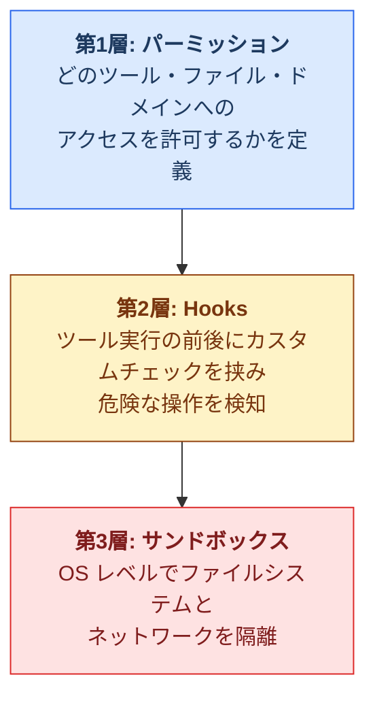

# バーンワークス株式会社 Claude Code 利用ガイドライン

**版数：** 1.0.1 （改訂履歴は文末に記載）  
**制定日：** 2026年4月1日  
**最終更新日：** 2026年4月28日  
**作成：** バーンワークス株式会社  
**対象者：** 社内従業員および開発委託先（外部パートナー）  
**対象OS：** macOS / WSL2（Ubuntu）  

---

## 1. 本ガイドラインの目的と適用範囲

### 1-1. 目的

本ガイドラインは、バーンワークス株式会社（以下「当社」）、および当社開発パートナーが関係する開発プロジェクトにおいて、Anthropic 社が提供する AI コーディングツール「Claude Code」を業務で安全かつ効果的に利用するための環境構築手順、セキュリティ設定、および運用ルールを定めたものです。

Claude Code はターミナル上で動作する AI エージェントであり、コードの読み書き、コマンドの実行、Git 操作などを開発者に代わって行います。適切な制限なしに使用した場合、ファイルの誤削除、認証情報の漏洩、意図しない外部通信といった重大なセキュリティインシデントにつながる可能性があります。

本ガイドラインに記載された設定と運用ルールを遵守し、安全な開発環境を維持してください。

### 1-2. 適用範囲

本ガイドラインは以下に該当するすべての関係者に適用されます。

- 当社の業務で Claude Code を使用する社内従業員
- 当社から開発業務を受託し、Claude Code を使用する外部パートナー

当社の業務に関連しない個人的な利用については、本ガイドラインの適用範囲外とします。

### 1-3. サブスクリプションプランの要件

Claude Code の利用には Anthropic 社の有料サブスクリプションが必要です。  
Pro 以上のプランであれば、パーミッション、サンドボックス、Hooks 等、本ガイドラインで必要とするセキュリティ機能はすべて利用可能です。モデルの品質にもプランによる差異はありません。

| 対象 | 必要なプラン | 備考 |
|---|---|---|
| 社内従業員 | Max（当社から配布） | 当社が各従業員に Max プランのサブスクリプションを提供します |
| 外部パートナー | Pro 以上 | 委託業務で Claude Code を使用する場合、Pro プラン（$20/月）以上の契約が必要です。プランの費用負担については個別の契約に従ってください |

> [!NOTE]
> Pro と Max の違いは使用量の上限のみです。大規模リポジトリの作業や長時間の継続利用で使用量制限に達する場合は、Max プランへのアップグレードを検討してください。プランの詳細は Anthropic 社の公式サイト（ https://claude.ai/pricing ）を参照してください。

### 1-4. 前提知識

本ガイドラインの読者には、以下の基本的な知識があることを前提としています。

- ターミナル（コマンドライン）の基本操作
- Git によるバージョン管理の基本
- JSON ファイルの読み書き

> [!NOTE]
> 本ガイドラインは 2026年4月時点の仕様に基づいています。Claude Code は頻繁にアップデートされるため、公式ドキュメント（ https://code.claude.com ）も併せて参照してください。

## 2. 用語の定義

本ガイドラインで使用する主要な用語を定義します。

| 用語 | 定義 |
|---|---|
| Claude Code | Anthropic 社が提供する、ターミナル上で動作する AI コーディングエージェント |
| パーミッション | Claude Code が使用できるツールやアクセスできるファイルを制御するルール |
| サンドボックス | OS レベルでファイルシステムとネットワークアクセスを隔離する仕組み |
| Hooks（フック） | Claude Code のツール実行前後にカスタムスクリプトを挟み込む仕組み |
| MCP サーバー | Model Context Protocol の略。Claude Code に外部サービス連携機能を提供する拡張機構 |
| プロンプトインジェクション | 悪意のある入力によって AI の動作を意図しない方向に誘導する攻撃手法 |
| CLAUDE.md | プロジェクト固有の指示を記述し、Claude Code に自動的に読み込ませるファイル |

## 3. セキュリティモデルの概要

具体的な設定手順に進む前に、Claude Code のセキュリティがどのように構成されているかを理解してください。

### 3-1. 多層防御の構造

Claude Code のセキュリティは、以下の3つの防御層で構成されています。いずれか1つだけでは十分ではなく、組み合わせて使用することで安全性が確保されます。



> [!TIP]
> **なぜ複数の層が必要か：** パーミッションの `Read(.env) deny` ルールは Claude Code の組み込みファイル読み取りツールをブロックしますが、Bash ツール経由の `cat .env` は阻止できません。OS レベルでアクセスを制限するサンドボックスを併用することで、この種の回避を防止できます。

### 3-2. パーミッションの評価順序

パーミッションルールは以下の順序で評価され、最初にマッチしたルールが適用されます。

```
1. deny（拒否） → 2. ask（確認を要求） → 3. allow（自動許可）
```

**deny は常に最優先です。** allow で許可されていても、deny にマッチすればブロックされます。

### 3-3. 設定ファイルの優先順位

Claude Code は複数の設定ファイルを読み込み、スコープの広いものから狭いものへと上書きされます。配列型の設定値（`permissions.allow` 等）は結合・重複排除されます。

| 優先度 | ファイルの場所 | スコープ |
|---|---|---|
| 最高 | マネージド設定（管理者が OS レベルで配置）※ | 組織全体。ユーザーによる上書き不可 |
| 高 | `.claude/settings.local.json`（プロジェクト内） | 個人のプロジェクト固有設定（Git 管理外） |
| 中 | `.claude/settings.json`（プロジェクト内） | チーム共有のプロジェクト設定（Git 管理対象） |
| 低 | `~/.claude/settings.json` | ユーザー個人の全プロジェクト共通設定 |

> [!NOTE]
> ※ マネージド設定は大規模組織の IT 管理部門向けの機能です。当社では使用しません。

#### 運用上の重要なポイント

- `.claude/settings.json` はリポジトリにコミットし、チーム全員で共有してください
- `.claude/settings.local.json` は個人設定用です。`.gitignore` に追加してください
- いずれかのレベルで deny されたツールは、他のレベルで allow しても使用できません

## 4. インストールと初期設定

### 4-1. 必要な環境

| 項目 | 最低要件 | 推奨 |
|---|---|---|
| OS（macOS） | macOS 13 Ventura 以上 | **macOS 26 Tahoe**（最新のセキュリティアップデート適用済み） |
| OS（Linux） | WSL2 上の Ubuntu 22.04 以上 | **Ubuntu 24.04 LTS** |
| メモリ（macOS） | 4GB 以上 | **8GB 以上**（16GB あればより快適） |
| メモリ（WSL2） | 4GB 以上 | **16GB 以上** |
| Anthropic アカウント | Pro 以上 | 社内従業員： Max（当社配布）/ 外部パートナー： Pro 以上（第1章 1-3 参照） |

> [!NOTE]
> **推奨 OS について：** macOS 13〜15（Ventura / Sonoma / Sequoia）は Claude Code の動作要件を満たしますが、Apple によるセキュリティアップデートの提供状況を考慮し、業務利用では最新の **macOS 26 Tahoe** を推奨します。同様に、Ubuntu は 22.04 LTS でも動作しますが、カーネルやライブラリの更新状況から **24.04 LTS** を推奨します。

> [!NOTE]
> **推奨メモリについて：** Claude Code 自体は AI 処理をクラウド側で行う軽量な CLI ツールであり、単体のメモリ消費はごくわずかです。ただし、業務では IDE、ブラウザ、開発サーバー、ターミナル等を同時に起動した状態で使用するため、それらを含めた総メモリ量が快適さを左右します。macOS では Apple Silicon のユニファイドメモリとメモリ圧縮により 8GB でも集中作業は可能ですが、Docker やブラウザを多用する場合は 16GB を推奨します。WSL2 は Windows ホスト上の仮想マシンとして動作するため、ホスト OS 自体のメモリ消費を考慮し 16GB 以上を推奨します。

### 4-2. インストール手順

#### 4-2-1. macOS

```bash
# ネイティブインストーラーによるインストール（推奨）
curl -fsSL https://claude.ai/install.sh | bash
```

インストール完了後、**新しいターミナルウィンドウを開いてから**以下を実行してください。

```bash
# インストールの確認
claude --version

# 環境診断（問題がないことを確認）
claude doctor
```

#### 4-2-2. WSL2（Ubuntu）

```bash
# サンドボックス機能に必要なパッケージのインストール
sudo apt update
sudo apt install -y bubblewrap socat

# ネイティブインストーラーによるインストール（推奨）
curl -fsSL https://claude.ai/install.sh | bash
```

インストール完了後、**新しいターミナルウィンドウを開いてから**以下を実行してください。

```bash
# インストールの確認
claude --version

# 環境診断
claude doctor
```

#### 4-2-3. npm 経由でインストールする場合（代替手段）

バージョン固定が必要な場合など、npm を使用するときは以下の手順に従ってください。Node.js 18 以上が必要です。

```bash
npm install -g @anthropic-ai/claude-code

# インストールの確認
claude --version
```

> [!IMPORTANT]
> `sudo npm install -g` は使用しないでください。パーミッションの問題やセキュリティリスクの原因となります。権限エラーが発生する場合は nvm（Node Version Manager）を使用して Node.js をインストールしてください。

### 4-3. 初回認証

```bash
# プロジェクトディレクトリに移動してから起動
cd /path/to/your-project
claude
```

初回起動時にブラウザが開き、Anthropic アカウントでの認証を求められます。画面の指示に従って認証を完了してください。

### 4-4. サンプル設定ファイルによるセットアップ
 
本リポジトリには、本ガイドラインに準拠したサンプル設定ファイルを同梱しています。以下の手順でコピーすることで、パーミッション、サンドボックス、Hooks の設定を一括で適用できます。
 
#### リポジトリの構成
 
```
├── README.md                  ← 本ガイドライン
├── settings.json              ← ~/.claude/settings.json のサンプル
└── hooks/
    └── block_dangerous.sh     ← 危険コマンドブロック用 Hooks スクリプト
```
 
#### セットアップ手順
 
```bash
# 1. 本リポジトリをクローン（または ZIP でダウンロード）
git clone https://github.com/burnworks/claude-code-guideline.git
cd claude-code-guideline
 
# 2. settings.json をコピー
cp settings.json ~/.claude/settings.json
 
# 3. Hooks スクリプトをコピーして実行権限を付与
mkdir -p ~/.claude/hooks
cp hooks/block_dangerous.sh ~/.claude/hooks/
chmod +x ~/.claude/hooks/block_dangerous.sh
 
# 4. 設定が正しく読み込まれることを確認
claude doctor
```
 
#### サンプル設定ファイルの内容
 
`settings.json` には以下の設定が含まれています。各設定の詳細は対応する章を参照してください。
 
| 設定項目 | 概要 | 詳細 |
|---|---|---|
| `defaultMode` | `default`（安全優先モード） | [5-3. パーミッションモードの選択](#5-3-パーミッションモードの選択) |
| `permissions` | allow / ask / deny ルール | [5-1. ユーザー共通設定](#5-1-ユーザー共通設定) |
| `sandbox` | サンドボックス有効化、ネットワーク制限、Docker 除外 | [7-2.](#7-2-有効化の手順) / [7-3.](#7-3-ネットワーク制限) / [7-4.](#7-4-docker-コマンドの除外) |
| `hooks` | PreToolUse による危険コマンドブロック | [8-4. 設定例](#8-4-設定例危険コマンドブロック用スクリプト) |
 
> [!TIP]
> サンプル設定はウェブ開発の一般的な構成を想定しています。プロジェクト固有の要件（使用する言語、外部サービス等）に応じて、第5章〜第8章を参照しながら内容を調整してください。
 
> [!IMPORTANT]
> 既に `~/.claude/settings.json` が存在する場合、上書きされます。既存の設定がある場合は、コピー前にバックアップを取るか、手動でマージしてください。

## 5. パーミッションの設定

### 5-1. ユーザー共通設定

`~/.claude/settings.json` はすべてのプロジェクトに適用されるユーザー個人の設定です。以下の内容をベースとし、各自の開発環境に合わせて調整してください。

`$schema` を指定すると、VS Code 等のエディタで設定キーの補完が有効になります。

```json
{
  "$schema": "https://json.schemastore.org/claude-code-settings.json",
  "defaultMode": "default",
  "permissions": {
    "allow": [
      "Bash(git status)",
      "Bash(git log *)",
      "Bash(git diff *)",
      "Bash(git add *)",
      "Bash(git commit *)",
      "Bash(git branch *)",
      "Bash(git checkout *)",
      "Bash(git switch *)",
      "Bash(git fetch *)",
      "Bash(ls *)",
      "Bash(head *)",
      "Bash(tail *)",
      "Bash(wc *)",
      "Bash(pwd)",
      "Bash(which *)",
      "Bash(npm run *)",
      "Bash(npx *)"
    ],
    "ask": [
      "Bash(git push *)",
      "Bash(git merge *)",
      "Bash(git rebase *)",
      "Bash(make *)",
      "Bash(node *)",
      "Bash(grep *)",
      "Bash(find *)"
    ],
    "deny": [
      "Bash(rm *)",
      "Bash(rmdir *)",
      "Bash(mv /* *)",
      "Bash(sudo *)",
      "Bash(chmod 777 *)",
      "Bash(curl *)",
      "Bash(wget *)",
      "Bash(nc *)",
      "Bash(ssh *)",
      "Bash(scp *)",
      "Bash(cat */.env*)",
      "Bash(cat */secrets*)",
      "Read(**/.env)",
      "Read(**/.env.*)",
      "Read(**/secrets.*)",
      "Read(~/.ssh/*)",
      "Read(~/.aws/*)",
      "Read(~/.config/gcloud/*)"
    ]
  }
}
```

#### 設定方針の説明

| 方針 | 具体例と理由 |
|---|---|
| コマンドは具体的なパターンで許可する | `Bash(npm run *)` のように限定する。`Bash(*)` のような全許可は禁止 |
| 外部通信コマンドは deny にする | `curl`, `wget`, `nc` はデータ漏洩経路となりうるため拒否 |
| 機密ファイルの読み取りを deny にする | `.env`, `secrets.*`, `~/.ssh/*`, `~/.aws/*` 等を拒否 |
| 破壊的操作は deny にする | `rm`, `sudo`, `chmod 777` 等を拒否 |
| `cat` の全許可は避ける | `cat .env` 等で機密情報が読み取られるため、`cat` を無条件に allow しない |
| 影響範囲が広い操作は ask にする | `git push`, `node *`, `make *` 等は確認を挟む |

> **注記:** Bash の deny ルールはコマンド引数のパターンマッチに依存するため、確実な制限にはなりません。ファイルやネットワークへのアクセスを確実に遮断するには、サンドボックス（第7章参照）を併用してください。

### 5-2. プロジェクト共有設定

`.claude/settings.json` はリポジトリにコミットし、プロジェクトメンバー全員で共有します。

```json
{
  "$schema": "https://json.schemastore.org/claude-code-settings.json",
  "permissions": {
    "allow": [
      "Bash(npm run build)",
      "Bash(npm run test *)",
      "Bash(npm run lint)"
    ],
    "deny": [
      "Bash(rm *)",
      "Bash(npm publish *)",
      "Read(**/.env*)",
      "Read(**/secrets*)"
    ]
  }
}
```

> [!IMPORTANT]
> このファイルに個人の認証情報やトークンを含めないでください。個人固有の設定が必要な場合は `.claude/settings.local.json` を使用し、`.gitignore` に追加してください。

### 5-3. パーミッションモードの選択

`defaultMode` には以下の値を設定できます。

| モード | 動作 | 業務利用の可否 |
|---|---|---|
| `default` | 変更前に確認を求める | **推奨。** 通常業務ではこのモードを使用してください |
| `acceptEdits` | ファイル編集は自動承認。コマンド実行は確認 | コードレビュー体制が整っている場合のみ可 |
| `plan` | 計画の作成のみで、実行はしない | 探索・調査・設計検討時に有用 |
| `dontAsk` | ほぼすべての操作を自動実行 | 業務での使用は禁止 |
| `bypassPermissions` | すべてのパーミッション制限を無視 | **使用禁止**（第10章参照） |

### 5-4. パーミッションの確認方法

Claude Code セッション内で以下のコマンドを使用すると、現在適用されているルールの一覧を確認できます。

```
/permissions
```

設定全般の確認・編集には以下のコマンドも利用できます。

```
/config
```

## 6. CLAUDE.md によるプロジェクト指示

### 6-1. 概要

`CLAUDE.md` は、プロジェクトルートに配置することで Claude Code が自動的に読み込む指示ファイルです。コーディング規約、使用してよいコマンド、禁止事項などを記述し、Claude Code の動作をプロジェクトの要件に合わせて制御します。

### 6-2. 推奨テンプレート

以下をベースとし、プロジェクトの実態に合わせて調整してください。

````markdown
# プロジェクト： [プロジェクト名]

## 基本ルール

- コードを変更する前に、必ず変更内容と影響範囲を説明すること
- ファイルを削除する操作は、確認を取るまで実行しないこと
- `.env` ファイルや認証情報が含まれるファイルは読み取らないこと
- 本番環境のデータベースやサーバーに対する操作コマンドは実行しないこと
- 外部へのネットワーク通信を伴うコマンドは実行しないこと

## 技術スタック

- 言語： TypeScript 6.x
- フレームワーク： Next.js 16, astro@latest
- パッケージマネージャー： npm
- テストフレームワーク： Vitest
- リンター / フォーマッター： ESLint, Prettier

## コーディング規約

- インデント： スペース 2 つ
- 文字コード： UTF-8
- 改行コード： LF
- セミコロン： なし（Prettier の設定に準拠）

## 使用してよいコマンド

- `npm run dev` — 開発サーバー起動
- `npm run build` — ビルド
- `npm run test` — テスト実行
- `npm run lint` — リントチェック

## 禁止事項

- `npm publish` の実行
- `git push --force` の実行
- データベースの DROP / TRUNCATE 操作
- node_modules の手動編集
````

## 7. サンドボックスの設定

### 7-1. サンドボックスの役割

サンドボックスは、Claude Code が実行する Bash コマンドおよびその子プロセスに対して、OS レベルでファイルシステムとネットワークのアクセスを制限する機能です。

パーミッションルールとの違いを以下に整理します。

| 観点 | パーミッション | サンドボックス |
|---|---|---|
| 制御の対象 | Claude Code の組み込みツール | Bash コマンドとその子プロセスすべて |
| 制限の粒度 | ツール単位のルールマッチ | OS カーネルレベルの強制 |
| `cat .env` の防止 | Read deny だけでは防止不可 | ファイルシステム隔離で防止可能 |
| ネットワーク制御 | WebFetch ドメインルール | プロキシによるドメインフィルタリング |

パーミッションとサンドボックスは排他ではなく、**両方を併用する**ことで多層防御が実現されます。

### 7-2. 有効化の手順

Claude Code セッション内で `/sandbox` コマンドを実行すると、そのセッションでサンドボックスが有効になります。

```
/sandbox
```

すべてのセッションで常時有効にするには、`~/.claude/settings.json`（ユーザー共通設定）に以下を追加してください。本リポジトリで配布しているサンプル設定ファイルにはこの設定が含まれています。

```json
{
  "sandbox": {
    "enabled": true,
    "autoAllowBashIfSandboxed": true,
    "allowUnsandboxedCommands": false
  }
}
```

各設定の意味は以下のとおりです。

| 設定キー | 説明 |
|---|---|
| `enabled` | サンドボックスを有効にする |
| `autoAllowBashIfSandboxed` | サンドボックス内の Bash コマンドを確認なしで自動許可する |
| `allowUnsandboxedCommands` | `false` にすると、サンドボックス外でのコマンド再実行を禁止する。**業務環境では必ず `false` に設定してください** |

### 7-3. ネットワーク制限

サンドボックスのネットワーク分離は、デフォルトですべての外部通信を拒否します。`allowedDomains` に登録されていないドメインへの通信はパーミッションプロンプトで確認され、許可するとそのセッション以降は記憶されます。

業務で頻繁に使用するドメインを事前登録しておくことで、不要なプロンプトを減らし生産性を維持できます。以下に、ウェブ開発で一般的に必要となるドメインを分類別に示します。

#### Claude Code の動作に必要なドメイン

| ドメイン | 用途 |
|---|---|
| `api.anthropic.com` | Claude Code 自体の API 通信 |

#### パッケージレジストリ（Node.js）

| ドメイン | 用途 |
|---|---|
| `registry.npmjs.org` | npm パッケージのダウンロード |
| `registry.yarnpkg.com` | Yarn 利用時のレジストリ |

#### ソースコード管理（GitHub）

| ドメイン | 用途 |
|---|---|
| `github.com` | Git 操作（HTTPS）、リポジトリアクセス |
| `api.github.com` | GitHub API（PR、Issue 操作等） |
| `*.githubusercontent.com` | GitHub の raw コンテンツ、アバター等 |

#### プロジェクトの技術スタックに応じて追加

| ドメイン | 用途 | 追加条件 |
|---|---|---|
| `pypi.org` | Python パッケージレジストリ | Python 利用時 |
| `*.pythonhosted.org` | Python パッケージの実体ダウンロード | Python 利用時 |
| `crates.io` | Rust パッケージレジストリ | Rust 利用時 |
| `deno.land` | Deno レジストリ | Deno 利用時 |
| `cdnjs.cloudflare.com` | CDN ライブラリ | フロントエンド開発 |
| `cdn.jsdelivr.net` | npm CDN | フロントエンド開発 |

以下は、上記のうちウェブ開発で一般的なドメインを含めた設定例です。プロジェクトの実態に合わせて取捨選択してください。

```json
{
  "sandbox": {
    "enabled": true,
    "allowUnsandboxedCommands": false,
    "network": {
      "allowedDomains": [
        "api.anthropic.com",
        "registry.npmjs.org",
        "registry.yarnpkg.com",
        "github.com",
        "api.github.com",
        "*.githubusercontent.com"
      ]
    }
  }
}
```

> [!WARNING]
> **セキュリティ上の注意：** `github.com` のような広範なドメインは、Gist や Issue コメントを経由したデータ漏洩経路となりえます。ただし開発ツールの大半が GitHub と通信するため、実質的には許可が必要です。このリスクを認識した上で、サンドボックスの他の制限（ファイルシステム隔離、deny ルール）と組み合わせて運用してください。

> [!TIP]
> **既知の制約：** Node.js のネイティブ `fetch()`（undici ベース）はプロキシ環境変数を参照しないため、サンドボックス内で許可済みドメインへの通信であっても失敗する場合があります。この問題が発生した場合は、プロキシ対応のライブラリに差し替えるか、該当コマンドを `excludedCommands` で除外して対処してください。

### 7-4. Docker コマンドの除外

Docker はサンドボックスのファイルシステム隔離と競合するため、`excludedCommands` で除外する必要があります。

```json
{
  "sandbox": {
    "enabled": true,
    "excludedCommands": ["docker", "docker-compose"]
  }
}
```

除外したコマンドには通常のパーミッションルールが適用されます。Docker を使用する場合は、パーミッションの `ask` ルールで確認を挟むことを推奨します。

### 7-5. macOS と WSL2 の違い

| 項目 | macOS | WSL2（Ubuntu） |
|---|---|---|
| 使用される技術 | Seatbelt（OS 内蔵） | bubblewrap + socat |
| 追加インストール | 不要 | 必要（第4章の手順を参照） |
| Unix ソケット | `allowUnixSockets` で個別に指定可能 | `allowAllUnixSockets` のみ対応 |

## 8. Hooks の設定

### 8-1. Hooks の役割と限界

Hooks は Claude Code がツールを実行する直前（`PreToolUse`）や直後（`PostToolUse`）に、指定したスクリプトを実行する仕組みです。既知の危険パターンのブロックや、実行ログの記録に活用できます。

**重要な制約事項:** Hooks はセキュリティの「補助層」であり、完全なセキュリティ境界ではありません。プロンプトインジェクション攻撃によって回避される可能性があるため、パーミッションルールおよびサンドボックスと必ず併用してください。

### 8-2. 主要なフックイベント

| イベント | 発火タイミング | 主な用途 |
|---|---|---|
| `PreToolUse` | ツール実行前 | 危険コマンドのブロック、入力の検証 |
| `PostToolUse` | ツール実行後 | ログ記録、結果の検証 |
| `Stop` | Claude Code の応答完了時 | 追加作業の指示、検証の実行 |

### 8-3. exit code の意味

| exit code | 動作 |
|---|---|
| `0` | 正常。ツール実行を続行する |
| `2` | ブロック。ツール実行を中断し、Claude Code にエラーを通知する |
| その他 | 警告として記録するが、実行は続行する |

### 8-4. 設定例：危険コマンドブロック用スクリプト

まず、以下のスクリプトファイルを作成します。

```bash
#!/bin/bash
# ~/.claude/hooks/block_dangerous.sh
#
# PreToolUse Hooks: Bash ツールの危険コマンドをブロックする
# exit 0 = 許可, exit 2 = ブロック
# JSON パースに python3 を使用（macOS / Ubuntu に標準搭載）

INPUT=$(cat)
COMMAND=$(echo "$INPUT" | python3 -c "
import sys, json
try:
    data = json.load(sys.stdin)
    print(data.get('command', ''))
except Exception:
    print('')
" 2>/dev/null)

DANGEROUS_PATTERNS=(
  "rm -rf /"
  "rm -rf ~"
  "rm -rf *"
  "sudo rm"
  "mkfs"
  "> /dev/sd"
)

for pattern in "${DANGEROUS_PATTERNS[@]}"; do
  if echo "$COMMAND" | grep -qF "$pattern"; then
    echo "[BLOCKED] 危険なコマンドパターンを検出しました: $pattern" >&2
    exit 2
  fi
done

exit 0
```

スクリプトに実行権限を付与します。

```bash
chmod +x ~/.claude/hooks/block_dangerous.sh
```

`settings.json` にフックを登録します。

```json
{
  "hooks": {
    "PreToolUse": [
      {
        "matcher": "Bash",
        "hooks": [
          {
            "type": "command",
            "command": "~/.claude/hooks/block_dangerous.sh"
          }
        ]
      }
    ]
  }
}
```

## 9. MCP サーバーの利用ルール

### 9-1. 概要

MCP サーバーは Claude Code に GitHub 連携やデータベースアクセスなどの追加機能を提供する拡張機構です。便利な反面、認証情報の受け渡しや外部通信が発生するため、管理されていない MCP サーバーの使用はセキュリティリスクとなります。

### 9-2. 利用ルール

- **当社が承認した MCP サーバーのみ**を使用してください
- 個人の判断で外部の MCP サーバーを追加することは禁止です
- 使用する MCP サーバーは `.claude/settings.json` または `~/.mcp.json` に明示的に記載してください
- 認証トークン等の機密情報は JSON に直接記述せず、**必ず環境変数を経由して渡してください**

### 9-3. 設定例（GitHub MCP Server）

以下は GitHub 公式の MCP サーバー（[github/github-mcp-server](https://github.com/github/github-mcp-server)）の設定例です。

#### 方法1： Docker 経由（推奨）
 
Docker が利用可能な環境では、バイナリのインストールが不要なこちらを推奨します。
 
```json
{
  "mcpServers": {
    "github": {
      "command": "docker",
      "args": [
        "run", "-i", "--rm",
        "-e", "GITHUB_PERSONAL_ACCESS_TOKEN",
        "ghcr.io/github/github-mcp-server"
      ],
      "env": {
        "GITHUB_PERSONAL_ACCESS_TOKEN": "${GITHUB_TOKEN}"
      }
    }
  }
}
```
 
#### 方法2： ローカルバイナリ（stdio）
 
GitHub MCP Server のバイナリをインストール済みの場合は、以下の設定を使用します。
 
```json
{
  "mcpServers": {
    "github": {
      "command": "github-mcp-server",
      "args": ["stdio"],
      "env": {
        "GITHUB_PERSONAL_ACCESS_TOKEN": "${GITHUB_TOKEN}"
      }
    }
  }
}
```
 
#### 方法3： Claude Code CLI からの追加
 
Claude Code の `mcp add` コマンドで直接追加することもできます。
 
```bash
# リモート HTTP サーバー（GitHub ホスト）を追加
claude mcp add --transport http github https://api.githubcopilot.com/mcp/ \
  -H "Authorization: Bearer ${GITHUB_TOKEN}"
```

> [!IMPORTANT]
> いずれの方法でも、GitHub Personal Access Token（PAT）は JSON に直接記述せず、環境変数 `GITHUB_TOKEN` を経由して渡してください。PAT には業務に必要な最小限のスコープ（`repo`, `read:org` 等）のみを付与してください。

## 10. 禁止事項

以下の行為は、本ガイドラインの適用範囲において禁止とします。違反が確認された場合は、プロジェクト管理者に報告してください。

### 10-1. 絶対禁止事項

| 禁止事項 | 理由 |
|---|---|
| `--dangerously-skip-permissions` オプションの使用 | すべてのパーミッション制限を無効化する。完全に隔離されたコンテナ環境以外での使用は禁止 |
| `bypassPermissions` モードの使用 | 上記と同等のリスクがある |
| `root` ユーザーまたは `sudo` での Claude Code の起動 | AI エージェントに管理者権限を与えてはならない |
| 機密ファイル（`.env`、認証鍵等）へのアクセス許可 | 認証情報漏洩の直接的な原因となる |
| 本番環境のデータベース接続情報を含む環境での使用 | 意図しないデータ操作・漏洩のリスクがある |
| 未承認の MCP サーバーの追加 | 情報漏洩やマルウェア実行のリスクがある |

### 10-2. 注意を要する操作

| 操作 | 対処方法 |
|---|---|
| `git push` を含む操作 | パーミッションの `ask` ルールで確認を挟む |
| Docker コマンド | `ask` ルールで確認し、サンドボックスの `excludedCommands` に設定する |
| 外部パッケージのインストール | パッケージの内容を確認してから承認する |
| 大量のファイル変更 | `git diff` で差分を確認してからコミットする |
| Claude Code が生成したコードのコミット | 必ず人間がレビューしてからコミットする |

## 11. データの取り扱いについて

### 11-1. Claude Code によるデータ送信

Claude Code は、コードの読み取りやコマンド実行結果を Anthropic のサーバーに送信して処理を行います。以下の点を理解した上で使用してください。

- Claude Code セッション中にアクセスしたファイルの内容やコマンド出力は、Anthropic のサーバーに送信されます
- このため、機密情報を含むファイルへのアクセスをパーミッションとサンドボックスで制限することが重要です
- Enterprise プランでは Zero-Data-Retention（ZDR）モードが利用可能です

### 11-2. 機密情報を扱うプロジェクトでの注意事項

- 機密情報を含むファイルは deny ルールとサンドボックスで二重にアクセスを制限してください
- 本番環境の認証情報、顧客データ、個人情報を含むファイルが存在するディレクトリでは Claude Code を起動しないでください
- 必要に応じて、Docker コンテナ内での利用を検討してください

## 12. コードレビューに関するルール

Claude Code が生成・編集したコードは、人間が作成したコードと同じレビュープロセスを経る必要があります。

- Claude Code による変更は必ず `git diff` で差分を確認してください
- プルリクエストの作成時には、Claude Code が関与したことをコミットメッセージまたは PR の説明に記載してください
- 自動生成されたコードであっても、品質・セキュリティ・ライセンスの責任はコミットした開発者にあります
- テストコードが生成された場合は、テスト内容が適切であることを確認してください

## 13. チェックリスト

### 13-1. 初期セットアップ完了確認

| 確認項目 | 完了 |
|---|---|
| Claude Code がインストールされている（`claude --version` で確認） | [ ] |
| `claude doctor` で環境診断に問題がない | [ ] |
| WSL2 の場合、`bubblewrap` と `socat` がインストールされている | [ ] |
| 本リポジトリの `settings.json` を `~/.claude/settings.json` にコピーした（[4-4 参照](#4-4-サンプル設定ファイルによるセットアップ)） | [ ] |
| 本リポジトリの `hooks/block_dangerous.sh` を `~/.claude/hooks/` にコピーし、実行権限を付与した | [ ] |
| `~/.claude/settings.json` の内容を確認し、deny ルールに `.env`、`~/.ssh`、`~/.aws` が含まれている | [ ] |
| `defaultMode` が `default` に設定されている | [ ] |
| サンドボックスが有効になっている | [ ] |
| `allowUnsandboxedCommands` が `false` に設定されている | [ ] |
| PreToolUse フック（危険コマンドブロック）が設定されている | [ ] |
| プロジェクトに `CLAUDE.md` が配置されている | [ ] |
| `.claude/settings.json` がリポジトリにコミットされている | [ ] |
| `.claude/settings.local.json` が `.gitignore` に追加されている | [ ] |

### 13-2. 日常利用の確認事項

| 確認項目 | 完了 |
|---|---|
| `root` や `sudo` で起動していない | [ ] |
| `bypassPermissions` や `--dangerously-skip-permissions` を使用していない | [ ] |
| 未承認の MCP サーバーを追加していない | [ ] |
| Claude Code の変更内容を差分確認してからコミットしている | [ ] |
| 機密情報を含むファイルにアクセスさせていない | [ ] |

## 付録A. トラブルシューティング

### サンドボックスが有効にならない（WSL2）

```bash
# bubblewrap のインストール確認
which bwrap && bwrap --version

# インストールされていない場合
sudo apt install -y bubblewrap socat
```

### パーミッションの確認が頻発して作業効率が低下する

日常的に使用する安全なコマンドは `allow` ルールに移動してください。また、サンドボックスを有効にすることで `autoAllowBashIfSandboxed: true` によりサンドボックス内の Bash コマンドの確認が自動省略されます。

### 設定が意図どおりに反映されない
 
設定ファイルの優先順位（第3章参照）を確認してください。プロジェクト設定（`.claude/settings.json`）の deny ルールはユーザー設定（`~/.claude/settings.json`）の allow では上書きできません。
 
```bash
# 設定ファイルの JSON 構文チェック
python3 -m json.tool < ~/.claude/settings.json
 
# セッション内で現在の設定を確認
/permissions
/config
```

### 全般的な問題の診断

```bash
# 環境全体の診断を実行
claude doctor
```

`claude doctor` は、認証状態、PATH の設定、MCP サーバーの状態、ファイルパーミッションなどを自動で検査します。

## 付録B. 参考リンク

| リソース | URL |
|---|---|
| Claude Code 公式ドキュメント | https://code.claude.com |
| インストール・セットアップ | https://code.claude.com/docs/en/setup |
| 設定リファレンス | https://code.claude.com/docs/en/settings |
| パーミッション設定 | https://code.claude.com/docs/en/permissions |
| Hooks リファレンス | https://code.claude.com/docs/en/hooks |
| サンドボックス解説（Anthropic エンジニアブログ） | https://www.anthropic.com/engineering/claude-code-sandboxing |

## 改訂履歴

| 版数 | 日付 | 変更内容 |
|---|---|---|
| 0.1.0 | 2026年4月1日 | 初版制定 |
| 1.0.0 | 2026年4月28日 | 一般公開 |
| 1.0.1 | 2026年4月28日 | テキストの微調整（内容に変更なし） |
